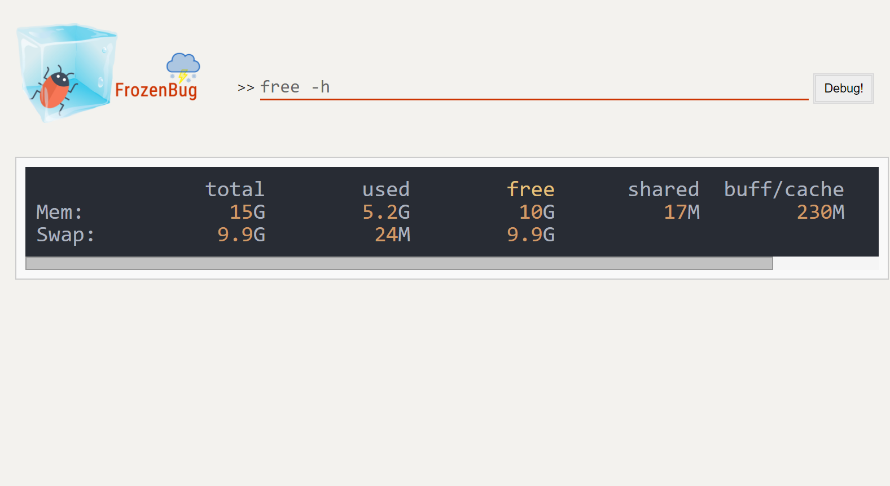

# FrozenBug

A computer aided programming software for Linux Subsystem on Windows 10

### Demo





### Installation & Usage

1. Open Microsoft Store and install Ubuntu.
2. Download [XAMPP for Linux](https://www.apachefriends.org/index.html) and install it.
3. Modify the working directory in */opt/lampp/etc/httpd.conf*.
> DocumentRoot "**/opt/lampp/htdocs**"
> <Directory "**/opt/lampp/htdocs**">
4. Restart the XAMPP.
```Bash
	sudo /opt/lampp/xampp restart
```
5. Download FrozenBug and put it into the working directory.
6. Open your browser and visit the page `http://localhost/`.
7. Input command and Debug! Have fun.
